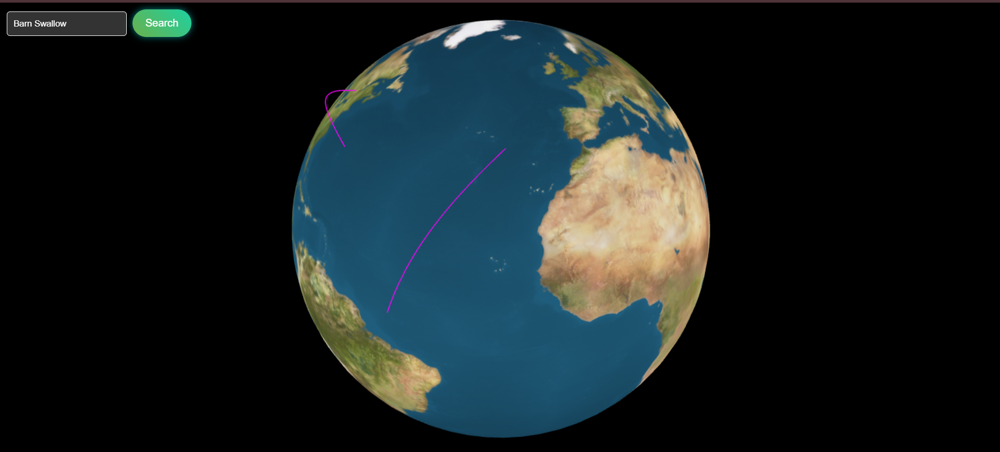

# Bird Migration Visualization Globe

 <!-- Add a screenshot of your project here -->

## Overview

The **Bird Migration Visualization Globe** is an interactive web application that showcases the migration patterns of various bird species around the globe. This project leverages **Three.js** to create a visually appealing 3D globe representation, allowing users to explore and visualize bird migrations in an engaging way.

## Features

- **Interactive 3D Globe**: Rotate and zoom into the globe to see different migration paths.
- **Dynamic Search**: Users can search for multiple bird species and visualize their migration routes in real-time.
- **Colorful Animation**: Migration lines change colors and have animated transitions for an immersive experience.
- **Tooltip Information**: Hovering over migration lines displays detailed information about the species and their migration journey.
- **Dropdown Selection**: Easily select bird species from a dropdown menu for quick searches.

## Demo

You can explore the live demo of the Bird Migration Visualization [here](https://tejas-007-11.github.io/bird-globe/).

## Technologies Used

- **HTML**: Structure of the web application.
- **CSS**: Styling and layout for the user interface.
- **JavaScript**: Interactivity and functionality, including the Three.js library for 3D rendering.
- **Three.js**: A JavaScript library that simplifies the creation of 3D graphics.

## Installation

To run this project locally, follow these steps:

```bash
1. Clone the repository:
   git clone https://github.com/your-github-username/your-repo-name.git

2. Navigate to the project directory:
   cd your-repo-name

3. Open index.html in your web browser.
